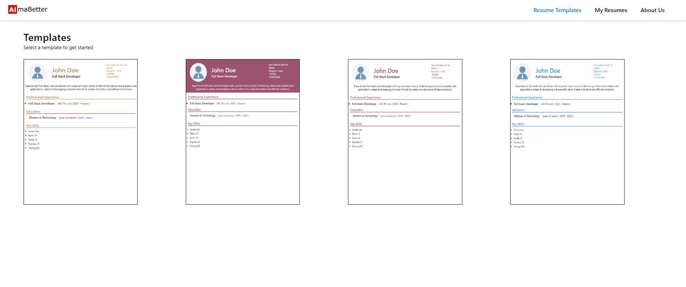
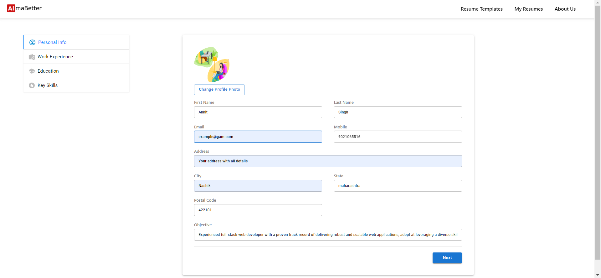
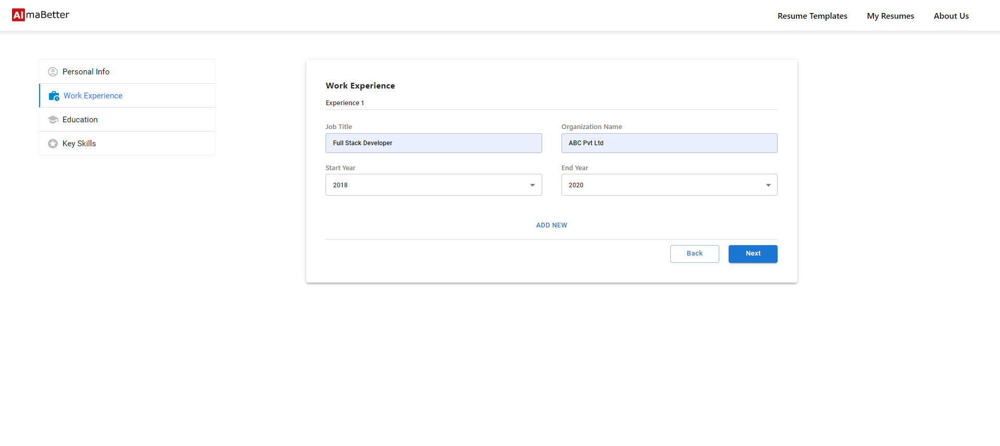
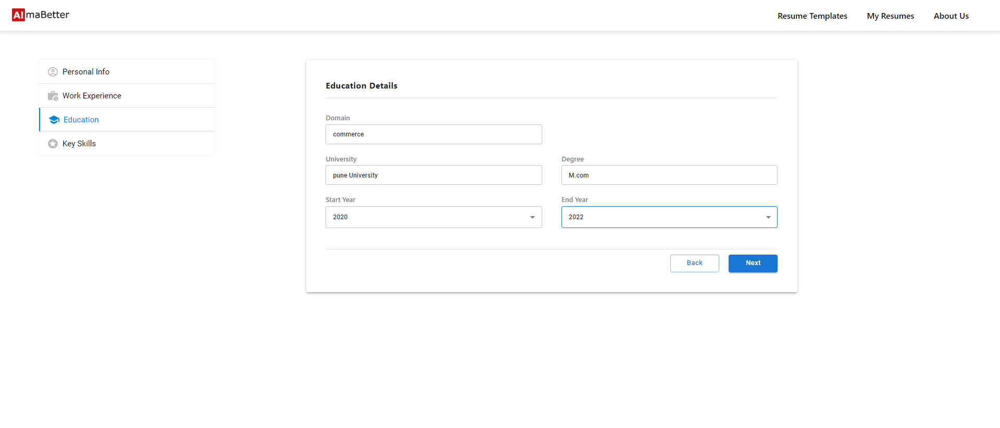
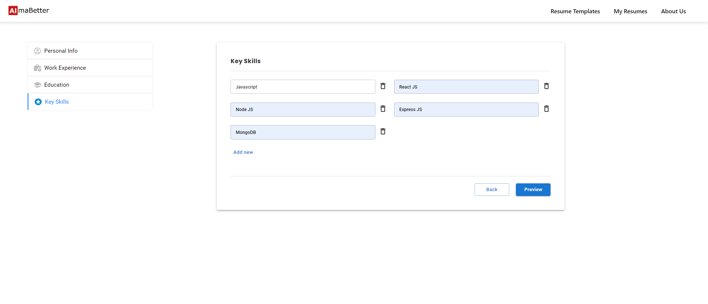
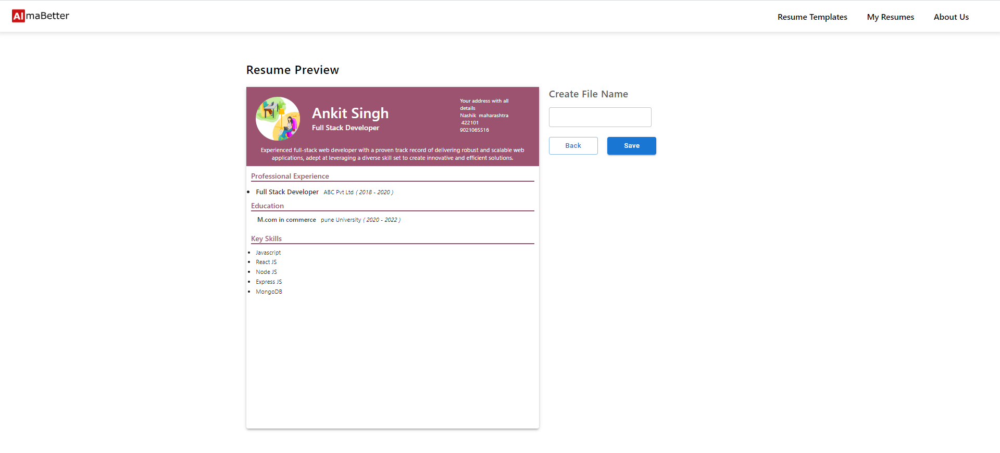
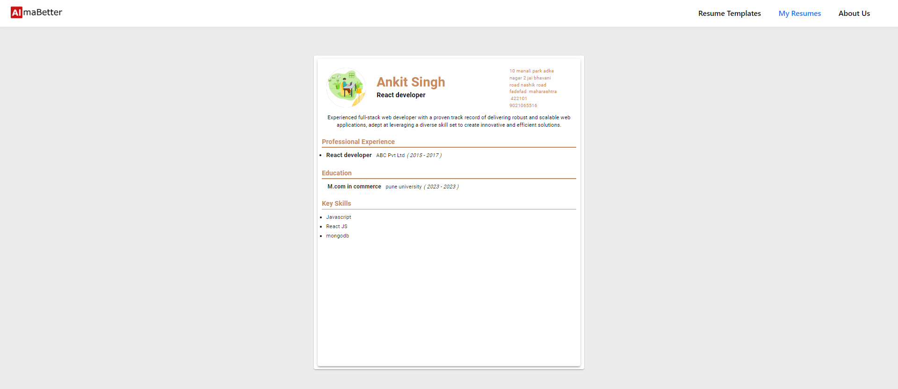
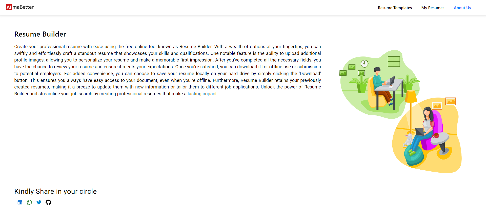

# Resume-Builder Project

## Introduction

Welcome to Resume-Builder: Revolutionizing Resume Creation
At Resume-Builder, we're on a mission to transform the way you create resumes. Our cutting-edge web application is designed to be your trusted partner in simplifying the resume creation process. We offer a wide array of templates, catering to job seekers, students, and professionals alike, all seeking to craft resumes that stand out from the crowd.
Your Resume, Your Way:
Are you a job seeker, eager to make a strong impression on potential employers? Perhaps you're a student, charting the course of your academic and professional journey. Or maybe you're a seasoned professional, keen on updating your resume to reflect your latest achievements.
No matter where you are in your career, Resume-Builder is here to empower you with the tools and templates you need to put your best foot forward.

Checkout web-app demo here - [Resume-Builder](app link)

## Table of Contents

- [Introduction](#introduction)
- [Screenshot](#screenshot)
- [Technologies](#technologies)
- [Features](#features)
- [Getting Started](#getting-started)
- [Prerequisites](#prerequisites)
- [Installation](#installation)
- [Usage](#usage)
- [Contributing](#contributing)
- [License](#license)
- [Acknowledgements](#acknowledgements)

## Screenshot










## Technologies

- HTML
- CSS
- JavaScript
- React

## Features

- Key Features:

- Resume Templates (Home Page): Our Home Page provides easy access to a diverse collection of professionally designed resume templates. You can select from these templates as a starting point for your resume.

- Resumes (Saved Resumes): The "Resumes" tab is your hub for managing and storing your saved resumes. You can create, edit, and delete resumes at your convenience. We believe in putting you in control of your professional story.

- About Us: Learn more about the creators and the inspiration behind Resume-Builder. We're passionate about empowering individuals to present their qualifications effectively.

- Profile Picture Integration: Add a personal touch to your resume by including a profile picture. Our user-friendly interface allows you to upload and position your profile picture effortlessly.

- Preview Before Download: Worried about how your resume will look? No problem! We offer a preview feature, so you can see exactly how your resume will appear before you download it.

- Save Locally: Don't lose your hard work. Resume-Builder enables you to save your resumes locally, ensuring that your progress is always within reach.

- Modify and Delete Resumes: Your career is dynamic, and so should be your resume. Easily modify and update your saved resumes to reflect your latest achievements and experiences. You can also delete resumes that are no longer needed.

- At Resume-Builder, we believe that a well-crafted resume is the key to opening doors to new opportunities. Our mission is to provide you with the tools and resources you need to create polished, professional resumes effortlessly.

## Getting Started

### Prerequisites

Before running the project, make sure you have the following prerequisites installed on your system:

- Node.js and npm: Install from [https://nodejs.org/](https://nodejs.org/)

## Installation

1. Clone the repository:

   ```bash
   git clone github link
    cd your-project
    npm install
   ```

### Usage

1. Start the server:

   ```bash
   npm start

   ```

2. Open your web browser and point it to the Resume-Builder application at `http://localhost:3000`.

3. Dive into the captivating world of resume creation as you peruse our extensive collection of professionally designed resume templates. Discover templates suited to your unique style and career aspirations.

4. Once you've found the perfect template that aligns with your vision, effortlessly access showtime details by selecting it as the foundation for your resume.

5. It's time to set the stage for your professional journey. Choose your preferred template, and start crafting your resume masterpiece. Our intuitive interface ensures you can effortlessly customize every aspect to suit your unique needs.

6. With your resume ready, you're just a few steps away from career magic. Follow the prompts to complete the resume-building process by providing the required information. Our user-friendly interface ensures a seamless experience.

7. Back on the homepage, relish the convenience of quick access to the details of your most recent resume creation. Our platform simplifies resume management, allowing you to edit, delete, and download your resumes with ease.

8. Unlock your career potential with Resume-Builder, where resume creation is a journey of self-expression and professional growth. Your path to a standout resume begins here.

### Contributing

We embrace contributions from our community of enthusiasts! If you're eager to contribute to our project, we'd appreciate it greatly. Just adhere to these guidelines:

```markdown
## Contributing

- Fork the repository.
- Create a new branch for your feature/bug fix.
- Make your changes and test thoroughly.
- Create a pull request with a clear description of your changes.
```

## Contributions

This project was conceived, designed, and implemented by Ankit Singh. As the sole author and developer, I have crafted every aspect of this project, from inception to completion.

While this project was created independently, I appreciate your interest and encourage you to explore and use it. If you have any questions, feedback, or suggestions, please feel free to reach out.

Thank you for checking out my work!

## License

This project is open source and is available under the [MIT License](LICENSE). The MIT License is a permissive open-source license that allows you to use, modify, and distribute this software for free, provided you include the original copyright notice and disclaimers.
For more details, please read the [LICENSE](LICENSE) file.

## Acknowledgements

I would like to express our gratitude to the developers and maintainers of the open-source packages and libraries that made this project possible. Without their contributions, our React application would not be as feature-rich and efficient as it is.

1. Core Dependencies

- **React**: A JavaScript library for building user interfaces.
- **React** DOM: A package for DOM-specific methods in React.
- **Redux**: A predictable state container for JavaScript apps.
- **React Redux**: Official React bindings for Redux.
- **React Router DOM**: A popular routing library for React applications.
- **Redux Thunk**: Middleware for handling asynchronous actions in Redux.
- **React Hook Form**: A library for managing forms in React with ease.
- **Material-UI**: A popular React component library that provides a set of high-quality components and styles.
- **JSPDF**: A library for generating PDFs in JavaScript.

2. Styling and UI

- **@emotion/react**: A library for writing CSS styles with JavaScript.
- **@mui/icons-material**: A set of Material Design icons for use with Material-UI.
- **@mui/material**: A Material Design-inspired component library for React.
- **react-avatar-edit**: A component for editing avatars.

These libraries and packages have played an integral role in the development of this project. We extend our gratitude to their creators and maintainers for their valuable contributions to the open-source community, enabling us to build robust and efficient Node.js applications.

---

You're most welcome to Resume-Builder! Should you have any inquiries or require additional support, please don't hesitate to get in touch with us or raise an issue within the repository. We're here to ensure your movie booking experience is nothing short of delightful! Enjoy your cinematic journey!
